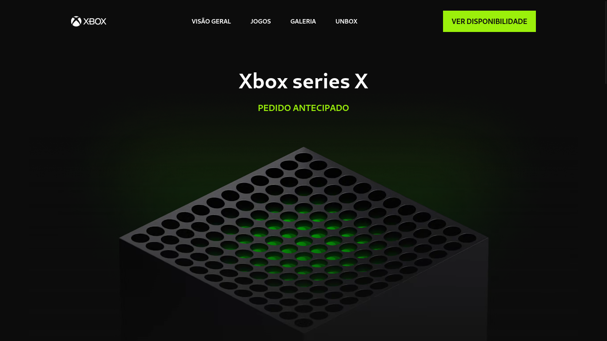

# Clone: Xbox Series X Page

This clone landing page shows important information of the Xbox Series X console, created for the purpose of learning and testing new technologies, it was made for other developers and students, as well as for recruiters to see development skills.

## Screenshots
<p align="center">
  


## Features

- Toggle frequently asked questions.


## Lessons Learned

I learned how to use the package manager PNPM, I really liked the way it organizes only the necessary modules, decreasing the volume in node_modules. 

For the first time I used a linter in my code, Eslint together with Prettier and Stylelint for Tailwindcss, I didn't get along at first with their strong opinion, but soon after I appreciated the fact that I didn't have to fix the syntax of the code manually.

I think my biggest challenge in the project was integrating a Vue3 library. In this case [*vue3-lazy-hydration*](https://github.com/freddy38510/vue3-lazy-hydration). As the name implies, it is a lazy hydration library. I had problems importing it so I opened an [issue](https://github.com/freddy38510/vue3-lazy-hydration/issues/36) and thanks to [@freddy38510](https://github.com/freddy38510) and [@dsvgl](https://github.com/dsvgl), I was able to use it.


## Optimizations

For the images I used the new *loading* parameters and set them to *lazy*. The goal is to improve performance by rendering only the visible images. [Read more](https://web.dev/i18n/pt/browser-level-image-lazy-loading/).

I also used the *vue3-lazy-hydration* library that uses the concept of lazy hydration with Vue3.


## Deployment

To build this project run:

```bash
  pnpm
  pnpm build
```

Deploy: https://desafio21-xbox.vercel.app/

## Acknowledgements

 - [Figma UI Challenge: Colelândia](https://www.figma.com/file/Yb9IBH56g7T1hdIyZ3BMNO/Desafios---Codel%C3%A2ndia)
 - [vue3-lazy-hydration](https://github.com/freddy38510/vue3-lazy-hydration)
 - [ScrollReveal](https://scrollrevealjs.org/)

## Authors

- [@Jolonte](https://github.com/Jolonte)

## License

[MIT](LICENSE)